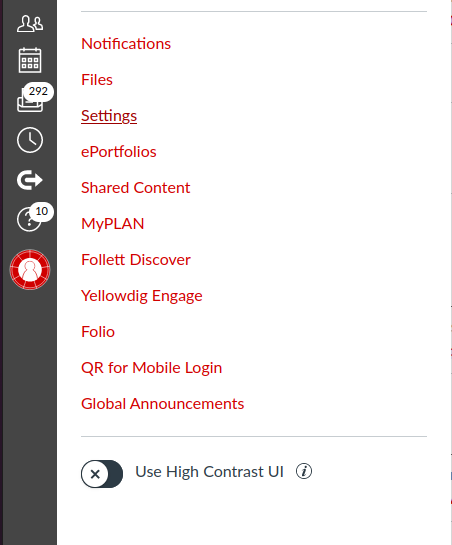

# Using the tool
To use the tool, the user needs to set the `ACCESS_KEY` constant in `discussion_automation.py` to their key generated for the canvas API.
## Generating an access token

First you need to click the account tab in canvas.

Next you need to click on "Settings" in the opened tab.

In the settings page click "New Access Token" and give it a unique name. Optionally you can also set an expiration date such as the end of the semester.

## Finding the course and discussion ID
For any given discussion topic it follows the pattern `https://canvas.unl.edu/courses/<course_id>/discussion_topics/<discussion_id>`
For example `https://canvas.unl.edu/courses/123218/discussion_topics/895856`, which points to the CSCE 468 check-in discussion, the course ID would be 123218 and the discussion ID would be 895856.

## Running the program
In this early stage of development there are not a lot of command line tools so the source code needs to be edited use that does not involve the posting to the CSCE 468 discussion board. The variables in the `__main__` portion of the code should be edited at this point to reflect the course and discussion id of the targeted discussion.